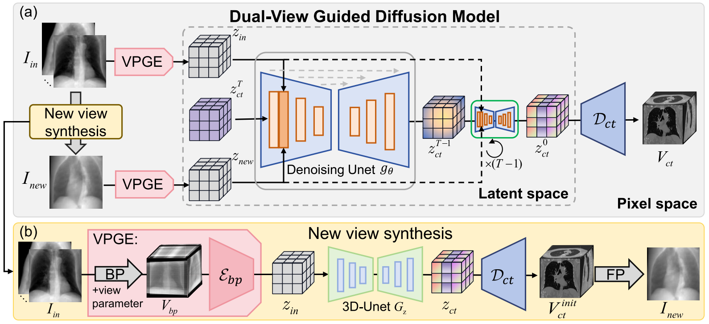
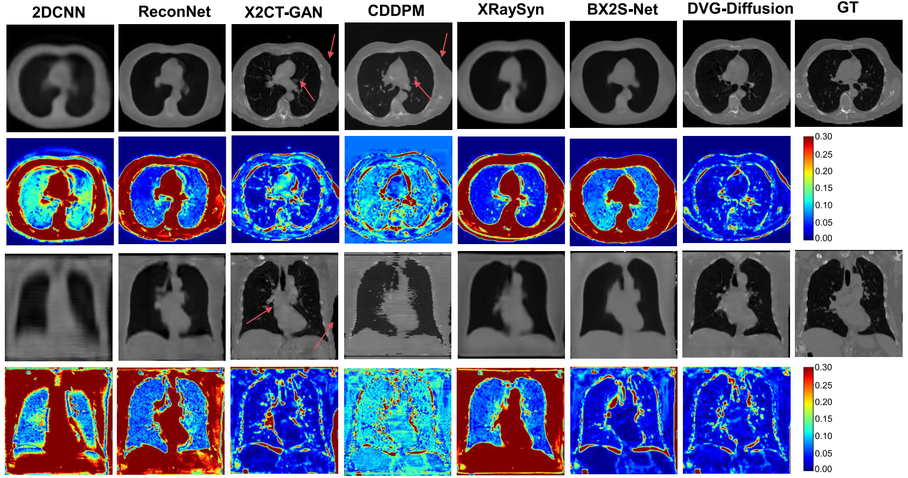

# DVG-Diffusion: Dual-View Guided Diffusion Model for CT Reconstruction from X-Rays

## Framework

<div align="center">

[](https://ieeexplore.ieee.org/document/11363161)&nbsp;

</div>



## Results



## Setup

This code has been tested on an NVIDIA RTX 4090 GPU.
Furthermore it was developed using Python v3.8 and CUDA 11.3.

In order to run our model, we suggest you create a virtual environment

`conda create -n dvg_diffusion python=3.8`

and activate it with

`conda activate dvg_diffusion`

Subsequently, download and install the required libraries by running

`pip install -r requirements.txt`

## Dataset

You can download the publicly available
[LIDC-IDRI](https://wiki.cancerimagingarchive.net/pages/viewpage.action?pageId=1966254) dataset
and preprocess the data following [X2CT-GAN](https://github.com/kylekma/X2CT)

Also, you need to compile drr_projector following
[https://github.com/cpeng93/XraySyn](https://github.com/cpeng93/XraySyn)

## Eval

You can validate by:

`python train/val_ddpm.py`

## Train

To train the VDG-Diffusinon, run this command:

`python train/train_ddpm.py`

## Acknowledgement

This code is build on the following repositories:

[https://github.com/FirasGit/medicaldiffusion](https://github.com/FirasGit/medicaldiffusion)

## 📚 BibTeX

```
@article{xie2026dvg,
title={Dvg-diffusion: Dual-view guided diffusion model for ct reconstruction from x-rays},
author={Xie, Xing and Liu, Jiawei and Fan, Huijie and Han, Zhi and Tang, Yandong and Qu, Liangqiong},
journal={IEEE Transactions on Image Processing},
year={2026},
publisher={IEEE}
}
```

